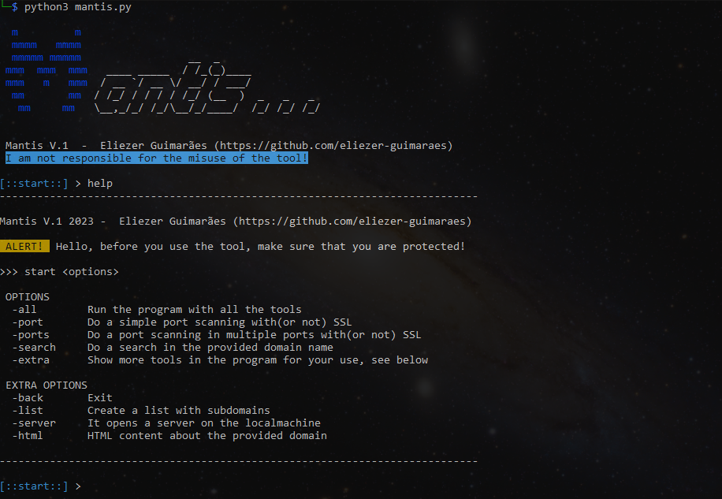

# MANTIS

<h3>ABOUT MANTIS V.1</h3>

MANTIS is a program containing tools for hacking, including <b>footprint</b>, <b>enumeration</b>, <b>port scanning</b>, <b>subdomain search</b>, and others. It was created with the aim of automating certain hacking tasks, to perform them quickly and effectively. MANTIS contains the following functions:

<ul>
  <li>Port scanning</li>
  <li>Server name search</li>
  <li>IP scanning</li>
  <li>Html headers search</li>
  <li>HTML content search</li>
  <li>Subdomain enumeration</li>
  <li>List creation</li>
  <li>Local server opening</li>
</ul>

<h3>!WARNINGS!</h3>
<b>Before using mantis, make sure that you are protected from external attacks. It's recommended that you use a VPN or Proxy!!!</b>

<h3>INSTALLATION</h3>

Make sure PIP is installed. Otherwise, visit https://pypi.org/project/pip/

<ul>
  <li><b>LINUX DISTRO</b>
    
First of all, install the program and the requirements:

    
    git clone https://github.com/eliezer-guimaraes/mantis
    cd mantis
    chmod +x *
    pip install -r requirements.txt
    
   
Now, create a alias in the .bashrc file for the program. In the file, write:

    
    alias mantis='python3 <mantis_path>/mantis.py'
    
  </li>
  <li><b>WINDOWS DISTRO</b>
    
It's the same process for Windows, in parts of course. First, install the ZIP file of the program and unzip it. After it, open your CMD: 

    
    cd <unzipped_program_file_path>
    pip install -r requirements.txt
    
   
Now, run it:

    
    python3 mantis.py
    
  </li>
</ul>

Mantis is in the testing phase! Any reports of errors or suggestions will always be welcome! <b>We are not responsible for the misuse of the tool!</b>
